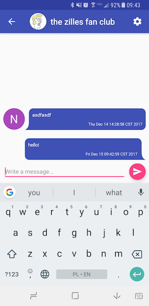

# Yet Another Messaging App

A small messaging app for android created as the final project for CS 126 at UIUC.

-

Features:

- Google Auth login via Firebase
- Firebase Real time database for storing messages and chatrooms updates in real time
- Push notifications via Firebase Cloud Functions and Cloud Messaging
- Supports group chats and direct messages